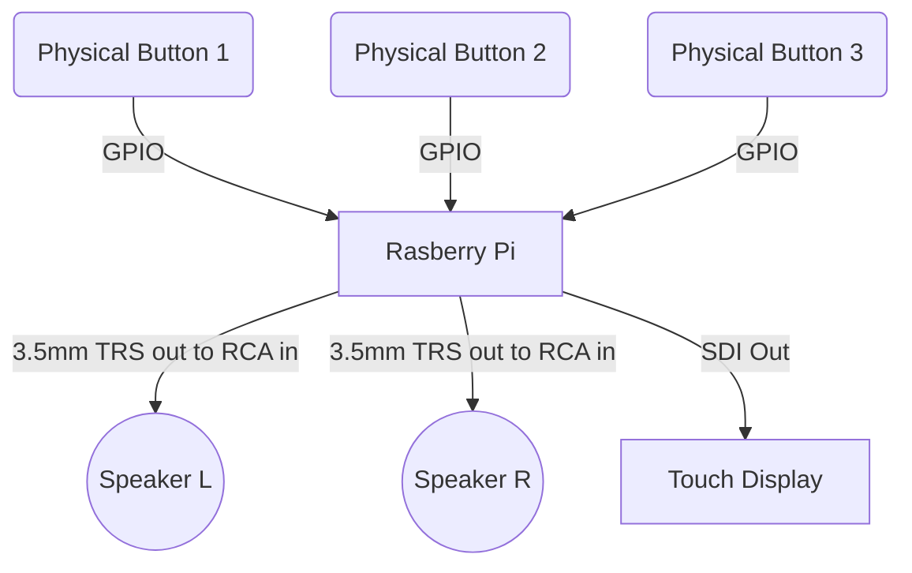
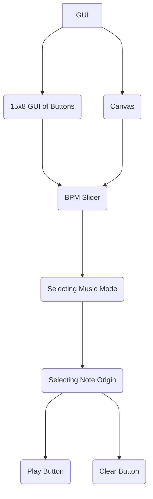

# Documentation
### This POC Documentation contains the codes and parts/hardware that we used in our project

In this project we were tasked to make a GUI which produces sound with a click of a button using Raspberry PI 4 Model B.

We have added different items to give the user a more advanced look at the GUI, such as a slider that adjust the BPM of the sound being produced.

The main purpose of the GUI is to allow the user to make and image and play it back to them in the form of sound.

## Table of Content

 - Setting up the GUI
	 - Import Projects
	 - Starting the Window
	 - Setting Variables
	 - Toggle
	 - Button
 - Functions
	 - Function - Press
	 -	Function - Play
	 - Function - Clear
- Song Library
	- Selecting note origin
	- Selecting music mode (sine, triangular, etc)
	- Selecting BPM
	- Play and Clear button
		- Play Button
		- Clear Button
- Concluding the GUI
	- Fullscreen Window
	- Packing frame in grid
	- Run window in constant loop
- Adding new features to the GUI
    - Preset Button
    - Volume Button
    - Canvas
    - Touch Screen Display
    - Activities
        - Mario!
        - Trace the Drawing

 

## Setting up the GUI

### Import of Files
The files, tkinter and pix2music are needed for to function the Python GUI. Tkinter functions the basis of a window, and pix2music translates the grid and parameters into an acoustic sound.
```
from tkinter import *
from pix2music import *
```
### Starting the window
Creating the window:
`main = Tk()`

Create a title for the window:
`main.title("My Fantastic GUI")`

Creating frames for the pixel grid (PixelFrame), and the buttons for parameter, play and clear (ButtonFrame):
```
PixelFrame = Frame(main)
ButtonFrame = Frame(main)
```
### Setting Variables
In the code, variable **R** would be the number of **Rows** and variable **C** would be the number of **Columns** the GUI has.
```
R = 15
C = 8
```
### Toggle
This creates the toggle list that will work in hand with the functions.
```
toggle = [i for i in range(R)]
for i in range(R):
    toggle[i] = [j for j in range(C)]
    for j in range(C):
        toggle[i][j]= 0
print("Toggle is {}". format(toggle))
```

### Button
This line of codes allow the Row and Columns to be read and to be created according to the size given

`
button = [i for i in range(R)]
`

The lambda function can take any number of arguments, but can only have one expression. In our code, we are using lambda as a way to convert the x and y values into a combined list in order to extract it. It is implemented as follows:

`
command = lambda get = [x,y]: press(get)
`

Full implemented code
```
for x in range(R):
    button[x] = [j for j in range(C)]
    for y in range(C):
        button[x][y] = Button(PixelFrame, 
				        text=f"{x},{y}", 
				        bg="grey", 
				        width=2, 
				        height=2,
				        command = lambda get = [x,y]: press(get))
        button[x][y].grid(row=x, column=y)
```
 


## Functions 

### Function - Press
This function allows the button to change colour when pressed. When the button is activated (“if” statement), the button will be GREEN in colour. When deactivated (“else” statement), it will be GREY in colour.
```
def press(get):
    x=get[0]; y=get[1]
    if toggle[x][y] == 0:
        toggle[x][y] = 1
        button[x][y].config(bg="green")
        
    else:
        toggle[x][y] = 0
        button[x][y].config(bg="grey")
    print("Toggle is {}". format(toggle))
```
### Function - Play 
This function allows the function to play the selected sounds by retrieving the selected BPM, note origin and soundtype from the user's selection and playing it back.
```
def play():
    global toggle
    print("toggle is {}".format(toggle))
    
    #Soundtype
    soundtype=soundtypevar.get()
    
    #BPM
    bpmvalue=  bpm.get()
    
    #Note Origin
    note = key_inside.get()
    
    #Integrate Music
    pix2music(soundtype,bpmvalue,note,toggle)
```

### Function - Clear
This function clears the users selection and return the buttons to the default colour of grey.
```
def clear():
    global toggle,button
    for i in range(R):
        for j in range(C):
            toggle[i][j]= 0
            button[i][j].config(bg="grey")
    print("Toggle is {}". format(toggle))
```
																					

## Song Library

### Selecting the note origin
Using a drop down, it will allow the user to pick their note origin as the base of the sound.
```
key = ['C1','C2','C3','C4','C5','C6']

key_inside = StringVar()
key_inside.set(key[3])

noteoriginlabel = Label(ButtonFrame,text="NOTE ORIGIN:")
key = OptionMenu(ButtonFrame, key_inside, *key)

noteoriginlabel.pack()
key.pack()
```

### Selecting music mode (sine, triangular, etc)
Using a drop down menu, the user can select the sound they want to play.
```
soundtypelabel=Label(ButtonFrame,text="SOUNDTYPE: ")
soundtypelabel.pack()
soundtypeoptions=[
    'pluck',
    'sine',
    'square',
    'triangle',
    'sawtooth',
    'trapezium'
]
soundtypevar=StringVar()
soundtypevar.set('pluck')
soundtypemenu=OptionMenu(ButtonFrame,soundtypevar,*soundtypeoptions)
soundtypemenu.pack()
```
###  Selecting BPM 
Using a slider, the user can slide to their desired BPM and can be adjusted easily.
```
bpmlabel = Label(ButtonFrame,text="BPM:")
bpm=Scale(ButtonFrame, from_=60, to=300, orient=HORIZONTAL)
bpmlabel.pack()
bpm.pack()
```

### Play and Clear button
#### Play Button
This line of code creates the “Play” button for the code to work in hand with the “Play” function
```
Play = Button(ButtonFrame,text="Play",command=play, width=5, height=2)
Play.pack()
```
#### Clear Button
This line of code creates the "Clear" button for the code to work with the "Clear" function.
```
Clear = Button(ButtonFrame,text="Clear",command=clear, width=5, height=2)
Clear.pack()
```
## Concluding the GUI

### Fullscreen Window
Make the screen in fullscreen mode:
`main.attributes("-fullscreen", True)`
### Packing frame in grid
```
PixelFrame.grid(row=0,column=0)
ButtonFrame.grid(row=0,column=1)
```
### Run window in a constant loop
`main.mainloop()`

## Flow Chart of Hardware
This is the flow of  hardware and how each component will work together. 



## Flow Chart of Software
This is the flow of  software and how each component will work together. 



## Adding new features to the GUI
 By adding new features into our peoject, it makes the GUI more engaging and makes it more enjoyable for the user

### Preset Button

### Physical Volume Buttons

### Canvas Mode

### Activites

#### Mario!

#### Trace the Drawing


As of 6th June 2022, 6:00pm
