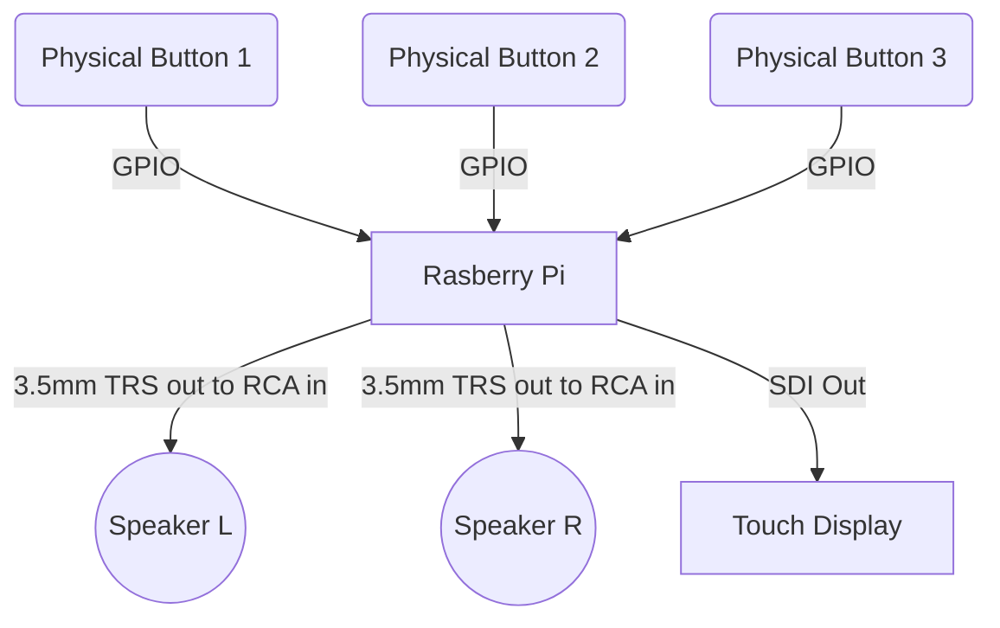
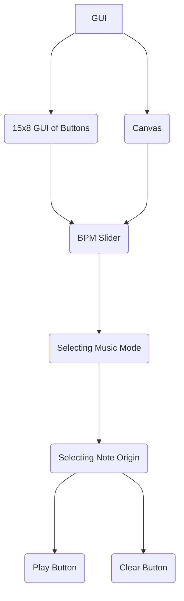

# Documentation
### This POC Documentation contains the codes and parts/hardware that we used in our project

In this project we were tasked to make a GUI which produces sound with a click of a button using Raspberry PI 4 Model B.

We have added different items to give the user a more advanced look at the GUI, such as a slider that adjust the BPM of the sound being produced.

The main purpose of the GUI is to allow the user to make and image and play it back to them in the form of sound.

## Table of Content

 - Setting up the GUI
	 - Import Projects
	 - Starting the Window
	 - Setting Variables
	 - Toggle
	 - Button
 - Functions
	 - Function - Press
	 -	Function - Play
	 - Function - Clear
- Song Library
	- Selecting note origin
	- Selecting music mode (sine, triangular, etc)
	- Selecting BPM
	- Play and Clear button
		- Play Button
		- Clear Button
- Concluding the GUI
	- Fullscreen Window
	- Packing frame in grid
	- Run window in constant loop
- Adding new features to the GUI
    - Preset Button
    - Volume Button
    - Canvas
    - Touch Screen Display
    - Activities
        - Mario!
        - Trace the Drawing

 

## Setting up the GUI

### Import of Files
The files, tkinter and pix2music are needed for to function the Python GUI. Tkinter functions the basis of a window, and pix2music translates the grid and parameters into an acoustic sound.

The Notebook library is implemented for Mode Switching between Button and Canvas Mode. the gpiozero library is used to implement GPIO pin connection for physical button use. Pause library is used to coincide with GPIO pins. Popen  is used to push codes onto the Terminal for Raspberry Pi use. PIL Image is necessary for image application.
```
from tkinter import *
from pix2music import *

#Additional libraries
from tkinter.ttk import Notebook
import gpiozero
from signal import pause
from subprocess import Popen
from PIL import Image
```
### Starting the window
Creating the window:
`main = Tk()`

Create a title for the window:
`main.title("Gaze the Beats")`

Create tabs for mode changing:
```
tabControl = Notebook(main)
tabControl.pack(expand = True, fill='both',side=LEFT)
```
Creating frames for the pixel grid (PixelFrame), canvas drawing (CanvasFrame), and the buttons for parameter, play and clear (ButtonFrame):
```
PixelFrame = Frame(tabControl)
CanvasFrame = Frame(tabControl)
ButtonFrame = Frame(main)
```
### Setting Variables
In the code, variable **R** would be the number of **Rows** and variable **C** would be the number of **Columns** the GUI has. CanvasC is a variable for the number of Columns used in the canvas.
```
R = 9
C = 15
CanvasC = 21
```
### Toggle
This creates the toggle list that will work in hand with the functions. A toggle for Canvas (toggleDraw) is also needed for indepedent use.
```
toggle = [i for i in range(R)]
toggleDraw = [i for i in range(R)]

for i in range(R):
    toggle[i] = [j for j in range(C)]
    for j in range(C):
        toggle[i][j]= 0
    toggleDraw[i] = [j for j in range(CanvasC)]
    for j in range(CanvasC):
        toggleDraw[i][j]= 0
print("Toggle is {}". format(toggle))
print("Toggle Draw is {}". format(toggleDraw))    

```

### Button
This line of codes allow the Row and Columns to be read and to be created according to the size given

`
button = [i for i in range(R)]
`

The lambda function can take any number of arguments, but can only have one expression. In our code, we are using lambda as a way to convert the x and y values into a combined list in order to extract it. It is implemented as follows:

`
command = lambda get = [x,y]: press(get)
`

Full implemented code
```
for x in range(R):
    button[x] = [j for j in range(C)]
    for y in range(C):
        button[x][y] = Button(PixelFrame, 
				        text=f"{x},{y}", 
				        bg="grey", 
				        width=2, 
				        height=2,
				        command = lambda get = [x,y]: press(get))
        button[x][y].grid(row=x, column=y)
```
 


## Functions 

### Function - Press
This function allows the button to change colour when pressed. When the button is activated (“if” statement), the button will be GREEN in colour. When deactivated (“else” statement), it will be GREY in colour.
```
def press(get):
    x=get[0]; y=get[1]
    if toggle[x][y] == 0:
        toggle[x][y] = 1
        button[x][y].config(bg="green")
        
    else:
        toggle[x][y] = 0
        button[x][y].config(bg="grey")
    print("Toggle is {}". format(toggle))
```

### Function - Play 
This function allows the function to play the selected sounds by retrieving the selected BPM, note origin and soundtype from the user's selection and playing it back.
Conditions of function includes which mode is currently used to use the toggle based on the mode, and the Play button to not activate if there is no pixel button or drawing triggered.
```
def play():
    #Soundtype
    soundtype = soundtypevar.get()
    
    #BPM
    bpmvalue = bpm.get()
    
    #Note Origin
    note = key_inside.get()
    
    #Mode checking
    #Integrate Music
    if tabControl.tab(tabControl.select(), "text") == "Button Mode":
        for t in range(len(toggle)):
            if 1 not in toggle[t]:
                pass
            else:
                pix2music(soundtype,bpmvalue,note,toggle)                
                break

            
    elif tabControl.tab(tabControl.select(), "text") == "Canvas Mode":
        for t in range(len(toggleDraw)):
            if 1 not in toggleDraw[t]:
                pass
            else:
                pix2music(soundtype,bpmvalue,note,toggleDraw)
                break
```

### Function - Clear
This function clears the users selection and return the buttons to the default colour of grey.
It also clears any content inside the canvas.
```
def clear():
    global toggle,button
    for i in range(R):
        for j in range(C):
            toggle[i][j]= 0
            button[i][j].config(bg="grey")
        for j in range(CanvasC):
            toggleDraw[i][j]= 0
    print("Toggle is {}". format(toggle))
    print("Toggle Draw is {}". format(toggleDraw))
    canvas.delete('all')
```																		

## Song Library

### Selecting the note origin
Using a drop down, it will allow the user to pick their note origin as the base of the sound.
```
key = ['C1','C2','C3','C4','C5','C6']

key_inside = StringVar()
key_inside.set(key[3])

noteoriginlabel = Label(ButtonFrame,text="NOTE ORIGIN:")
key = OptionMenu(ButtonFrame, key_inside, *key)

noteoriginlabel.pack()
key.pack()
```

### Selecting music mode (sine, triangular, etc)
Using a drop down menu, the user can select the sound they want to play.
```
soundtypelabel=Label(ButtonFrame,text="SOUNDTYPE: ")
soundtypelabel.pack()
soundtypeoptions=[
    'pluck',
    'sine',
    'square',
    'triangle',
    'sawtooth',
    'trapezium'
]
soundtypevar=StringVar()
soundtypevar.set('pluck')
soundtypemenu=OptionMenu(ButtonFrame,soundtypevar,*soundtypeoptions)
soundtypemenu.pack()
```
###  Selecting BPM 
Using a slider, the user can slide to their desired BPM and can be adjusted easily.
```
bpmlabel = Label(ButtonFrame,text="BPM:")
bpm=Scale(ButtonFrame, from_=60, to=300, orient=HORIZONTAL)
bpmlabel.pack()
bpm.pack()
```

### Play and Clear button
#### Play Button
This line of code creates the “Play” button for the code to work in hand with the “Play” function
```
Play = Button(ButtonFrame,text="Play",command=play, width=5, height=2)
Play.pack()
```
#### Clear Button
This line of code creates the "Clear" button for the code to work with the "Clear" function.
```
Clear = Button(ButtonFrame,text="Clear",command=clear, width=5, height=2)
Clear.pack()
```
## Concluding the GUI

### Fullscreen Window
Make the screen in fullscreen mode:
`main.attributes("-fullscreen", True)`
### Packing frame in grid
```
PixelFrame.pack(fill='both',expand=True)
CanvasFrame.pack(fill='both',expand=True)
ButtonFrame.pack(side=RIGHT)
```
### Mode Tabs
```
tabControl.add(PixelFrame, text='Button Mode')
tabControl.add(CanvasFrame, text='Canvas Mode')
```
### Run window in a constant loop
`main.mainloop()`

## Flow Chart of Hardware
This is the flow of  hardware and how each component will work together. 



## Flow Chart of Software
This is the flow of  software and how each component will work together. 



## Adding new features to the GUI
 By adding new features into our peoject, it makes the GUI more engaging and makes it more enjoyable for the user.

### Preset Button
With the addition of the preset button, it allows the user to see an exmaple of how to GUI should be used.
```
def preset():
    if tabControl.tab(tabControl.select(), "text") == "Button Mode":
        activity_1()

    elif tabControl.tab(tabControl.select(), "text") == "Canvas Mode":
        activity_2()

Preset = Button(ButtonFrame,text="Preset",command=preset, width=5, height=2)
Preset.pack()

#Physical Preset Buttons via GPIO
button_A1 = gpiozero.Button(6)
button_A1.when_pressed=activity_1
button_A2 = gpiozero.Button(5)
button_A2.when_pressed=activity_2
```
### Physical Volume Buttons
By adding 3 physical buttons, it allows the user to increase, decrease or mute the audio coming out from the Raspberry Pi.
#### Function - Volume
These functions allow volume control such as increase & decrease volumne, and mute audio. pix2music is used as an audio feedback.
```
#Button Volume Functions
def increase_volume():
    Popen(['amixer','set', 'PCM', '500+'])
    pix2music('sine',100,'D4',[[1]])
    
def decrease_volume():
    Popen(['amixer','set', 'PCM', '500-'])
    pix2music('sine',100,'D4',[[1]])

def mute():
    Popen(['amixer','set', 'PCM', 'toggle'])
    pix2music('sine',100,'D4',[[1]])
```
GPIO pins implementation for volume control
```
button_up = gpiozero.Button(21)
button_up.when_pressed=increase_volume
button_down = gpiozero.Button(20)
button_down.when_pressed=decrease_volume
button_mute = gpiozero.Button(26)
button_mute.when_pressed=mute

pause()
```

### Canvas Mode
Instead of clicking pixels, we have given the option to actually draw with the help of the touch display. 
#### Function - Canvas
These functions is used to create points of drawing (addLine), drag the points of drawing when used in motion (savePosn) and to activate toggle points when interacted in specific positions (draw)
```
def savePosn(event):
    global lastx, lasty
    lastx, lasty = event.x, event.y
    toggleX = int(event.x/32.5)
    toggleY = int(event.y/47.5)
    print(toggleX,toggleY)
    get = [toggleY,toggleX]
    draw(get)
    
def addLine(event):
    canvas.create_oval(lastx, lasty, lastx+5, lasty+5, fill="black")
    savePosn(event)
    
def draw(get):
    x=get[0]; y=get[1]
    if toggleDraw[x][y] == 0:
        toggleDraw[x][y] = 1
        print(toggleDraw)
```

creating a canvas, with bind used to acknowledge control on mouse cursor/touch display pressing
```
canvas = Canvas (CanvasFrame,height=R*47.5,width=CanvasC*32.5,bd=1,relief='ridge')
canvas.pack()
canvas.bind("<Button-1>", savePosn)
canvas.bind("<B1-Motion>", addLine)
```

### Touch Display
A touch display enhances playability for the GUI with ease with the touch by their hand, especially for Canvas Mode.

### Activites
We have made different activities to engage the user to play around and guess the different sounds played.

#### Mario!
Benefits for first time users, to learn the use of the pixel grid and play their drawing with a familiar tune.
```
def activity_1():
    mario_row = [0,0,1,1,2,2,3,3,4,4,5,5,8,8]
    mario_column = [2,7,2,7,2,7,0,5,2,7,4,9,0,2]
    for i in range(len(mario_row)):
        button[mario_row[i]][mario_column[i]].config(bg="#AFE1AF")
```

#### Trace the Drawing
Play and learn the enhance capabilities of drawing on a canvas, with the use of the touch display adding more playability.
```
def activity_2():
    canvas.create_image(50, 50, image=tree,anchor = "nw")

tree = PhotoImage(file='/home/pi/Project/cartoon_tree.png')
tree = tree.subsample(1, 2)

#### Variety of Beats
The added parameters (BPM, Soundtype and Note Origin) adds more variety of sounds and effects for the users
```

As of 4th August 2022, 12:00am
